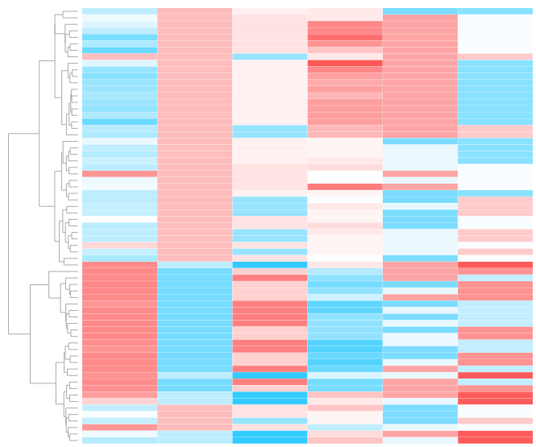

# Research

[ **[Research](/index.md)** ][ [Curriculum Vitae](/cv.md) ][ [Github](https://github.com/molikd) ][ [Contact](/contact.md) ]

---
I'm a Computational Genomicst finishing up a PhD at Notre Dame looking at various aspects of metabarcoding, including simulation of, use in NLP, and population genomics applications. However, I'm more interested in Genome Annotation in non-model systems and am moving in that direction for my Post-doc. I am fairly competent in Genome Assembly, having created genomes for a out-coming publication on the use of continuous culture systems to detect mutagencity. I learned Computer Science and programming in my undergraduate at Rensselaer Polytechnic Institute, through my job at Synacor Inc. and into my bioinformatics position at Cold Spring Harbor Labratory. I then Switched into Computational Biology at CSHL and into my PhD at the University of Notre Dame. I am currently teaching the Introduction to Computational Genomics (BIOS 60132) course here at the University of Notre Dame.

During my thesis I was interested in the factors that affect microbial communities’ diversity overtime. Which and how much of deterministic factors, like the environment that the microbes are occupying, and then more stochastic things, like selection and genetic drift affect the communities. I utilized Computational Genomics, and Computational Ecology to look at the dynamics of this relationship. This central Computational Eco-Evo theme lends itself to other questions: What new computational tools need to exist in order to gain a deeper understanding of this dynamic? When exposed to an increasing deterministic factor, like salt concentration, how will microbial communities respond? How do microbial communities recover after stress?

In order to answer these questions, I both write new software, generally in the vain of big data, as well as use experimental systems, specifically the tool-set that metabarcoding and whole genome sequencing can provide. This means that I implement new data-basing and alignment strategies in order to solve the questions that I am interested in.

 
`environmental variables influencing sample to sample simularity`

I have also researched computational methods in general, mostly with ecological data. A lot of this work has been in Metabarcoding, which is the idea of using a single gene region to parse out which species are in a sample; Working out how to associate community structure with the environment; and looking at rare and pathogenic species in large amounts of data. I've also used Natural Language Processing to look for metadata of academic journal articlies which use metabarcoding. And I've also experimented with K-mer comparison methods that estimate distances between gnomic data can be used to generate environmental sample to sample distances in both metagenomic and metabarcoding applications. A pair-wise matrix of distances can be clustered via hierarchical methods. This De novo clustering of k-mer derived distances may describe the community structure of such samples, and may correlate with the environment. Such is the case with data correlated with soil measurements in the Atacama desert or data of shipping ports with sampling location from around the world. Some of the algorithms that can be leveraged to do this, like those using sketching (as is the case with Mash), suffix trees, or de Bruijn graphs show increased speed over original methods. Such methods can also be used to determine the presence or absence of a targeted species, as is shown with the search for the yeast C. Neoformans in 12634 18S metagenomic datasets. Available methods in k-mer analysis can be used in metagenomic and metabarcoding studies for the determination of significant subsets and for the presence absence of particular species.

 
`12634 18S metagenomic datasets compared to eachother, colored by type of source, ie:soil vs. aquatic, I accidentally put my coffee down on the visualization which accounts for the stain.`

<meta name="keywords" content="David Molik, Molik, Metagenetic, Metabarcoding"/>
<meta name="description" content="David Molik's research interests: Expploring Metagenetic and Metabarcoding analysis"/>
<meta name="subject" content="david.molik.co : A Personal Webpage">
<!-- 

